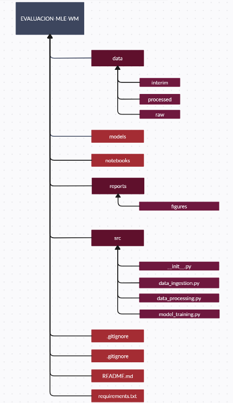

# Prediccion de lluvia

Modelo de machine learning que predice si lloverá o no al dia siguiente.

## Estado del Proyecto

[](URL)

## Tabla de Contenidos

- [Requisitos](#requisitos)
- [Instalación](#instalación)
- [Uso](#uso)
- 


## Requisitos

- Python 3.12.4

## Instalación

1. Clona el repositorio:
    ```bash
    git clone https://github.com/usuario/proyecto.git
    ```
2. En la terminal, navegar a la carpeta dle proyecto. Una vez dentro de la carpeta del proyecto crea un ambiente virtual:

    Para windows:
    ```bash
    python -m venv myenv
    ```
    Para Linux
     ```bash
    python3.12 -m venv myenv
    ```
3. Activar entorno virtual.
     Para windows:
    ```bash
    .\myenv\Scripts\activate
    ```
    Para Linux
     ```bash
    source myenv/bin/activate
    ```
4. Instala las dependencias:
    Si es necesatio, actualiza pip

    ```bash
    pip install -r requirements.txt
    ```


## Uso

Ejemplo de cómo usar el proyecto:

```bash
python main.py
```

## Estructura-del-proyecto